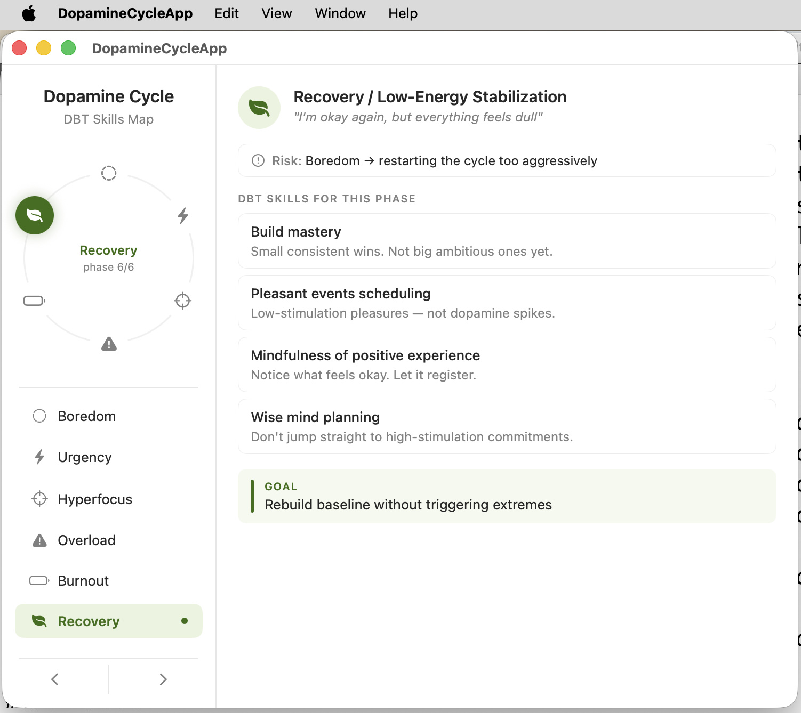
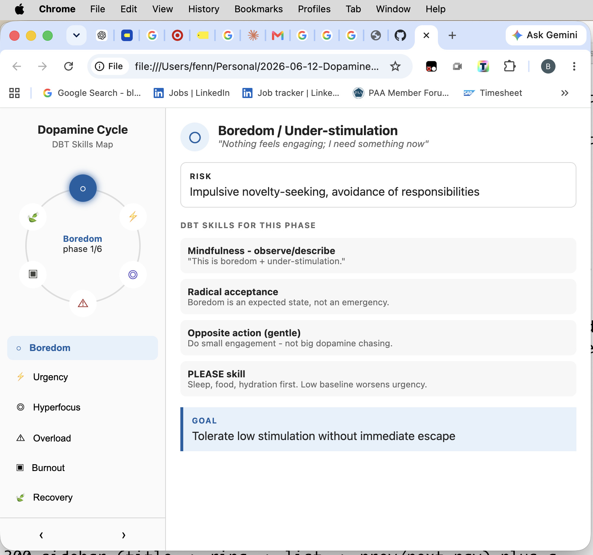

# Dopamine Cycle - DBT Skills Map

An interactive visual map of an AuDHD dopamine/attention regulation cycle, paired with DBT-inspired skills for each phase.

[Try the Dopamine Cycle App](https://fennellb.github.io/dopamine-cycle-web/web/DopamineCycleApp.html)

## Overview

The goal of this project is not to "fix" the dopamine cycle, but to recognize different states and apply appropriate skills at the right transition points.

The app models six phases:

1. Boredom / Under-stimulation
2. Dopamine Seeking / Urgency Spike
3. Hyperfocus / High Engagement
4. Overload / Sensory + Cognitive Saturation
5. Burnout / Shutdown
6. Recovery / Low-Energy Stabilization

Each phase displays:

- common experience
- risks
- regulation goals
- DBT skills and strategies

## The Core Idea

The cycle itself is not the problem.

The challenge is moving through the cycle without awareness or regulation.

The purpose of the map is:

- Mindfulness notices the phase
- Distress Tolerance stabilizes spikes
- Emotion Regulation rebuilds baseline
- Acceptance reduces the struggle against the current state

## Screenshots

Stand Alone Apple MacOS App



Web Based XHTML and Javascript



## Versions

### SwiftUI Version

The original implementation is a macOS SwiftUI application.

Architecture:

```

ContentView
|
+-- CycleRingView
|       |
|       +-- Phase selection
|
+-- PhaseDetailView
|
+-- Skills
+-- Risks
+-- Goals

```

The app uses a master-detail interface:

- Sidebar: phase navigation
- Circular ring: spatial navigation
- Detail panel: phase information

## Web Version

A single-page XHTML/JavaScript implementation is also included.

Features:

- no build system required
- runs directly in a browser
- CSS animations
- JavaScript state management
- portable single-file application

Open:

```

DopamineCycleApp.html

```

in any modern browser.

## DBT Skill Mapping

### 1. Boredom / Under-stimulation

> "Nothing feels engaging; I need something now"

Risk:

- impulsive novelty seeking
- avoidance of responsibilities

Skills:

- Mindfulness (Observe/Describe)
- Radical Acceptance
- Gentle Opposite Action
- PLEASE skill

Goal:

> Tolerate low stimulation without immediate escape

---

### 2. Dopamine Seeking / Urgency Spike

> "I need to do something interesting RIGHT NOW"

Risk:

- task switching
- rabbit holes
- impulsive commitments

Skills:

- STOP skill
- Urge Surfing
- Delay + Distract
- Wise Mind check

Goal:

> Prevent impulsive escalation into hyperfocus traps

---

### 3. Hyperfocus / High Engagement

> "I'm locked in; time disappears"

Risk:

- missed meals
- sleep loss
- overcommitment

Skills:

- Mindfulness of Current Activity
- Interoceptive Awareness
- Planned Pausing
- Self-validation

Goal:

> Keep engagement without losing regulation

---

### 4. Overload / Sensory + Cognitive Saturation

> "Too much; everything feels heavy or irritating"

Risk:

- shutdown
- irritability
- emotional flooding

Skills:

- TIPP skills
- Reduce Input
- One-mindfulness
- Radical Acceptance

Goal:

> Downshift physiological arousal

---

### 5. Burnout / Shutdown

> "I can't do anything; everything feels impossible"

Risk:

- avoidance spiral
- guilt
- loss of momentum

Skills:

- Self-validation
- PLEASE skill
- Smallest Effective Action
- Radical acceptance of limits (tiny Opposite Action)

Goal:

> Restart motion without forcing full capacity

---

### 6. Recovery / Low Energy Stabilization

> "I'm okay again, but everything feels dull"

Risk:

- restarting the cycle too aggressively

Skills:

- Build Mastery
- Pleasant Events Scheduling
- Mindfulness of Positive Experience
- Wise Mind Planning

Goal:

> Rebuild baseline without triggering extremes

## Project Status

Early prototype.

Future possibilities:

- reminders and timers
- personal phase tracking
- journal/history view
- customizable skills
- ADHD/autism-friendly transition support

## Technology

SwiftUI:

- macOS desktop application
- Swift data model
- SwiftUI views

Web:

- XHTML
- JavaScript
- CSS

## License

Personal project. License TBD.
